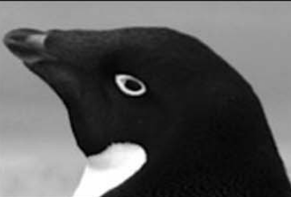

```{r setup, include=FALSE}
knitr::opts_chunk$set(echo = TRUE)
```

# Introduction

## Study context



This document is a report on the analysis of a dataset on penguins. The data collected contains informations on multiples variables. The dataset was found on Kaggle : <https://www.kaggle.com/datasets/utkarshx27/penguin-size-clutch-and-blood-isotope-data?select=penguins_raw.csv>. This dataset was assemble from various articles according by Gorman et al. [@gorman2014]and Horst et al. [@m.horst2022]. It focused on three penguin species : Adelie (Pygoscelis adeliae), Chinstrap (Pygoscelis antarcticus) and Gentoo (Pygoscelis papua). The dataset contains 344 observations and 17 variables. The goal of this analysis is to explore the dataset and to identify the main characteristics of the penguins.

```{r}
library(factoextra)         # for data visualization
library(FactoMineR)         # for PCA
library(tidyverse)          # for data manipulation and visualization
library(dplyr)              # for data manipulation
library(ggplot2)            # for data visualization
library(corrplot)           # for correlation test
library(sf)                 # for spatial data
library(rnaturalearth)      # for earth maps
library(rnaturalearthdata)  # for earth dataset
library(ggspatial)          # for spatial plot
library(gridExtra)          # for arranging plot
library(kableExtra)         # for enhanced tables

# Just to be on the safe side...
sf::sf_use_s2(FALSE)
```

## Location

Data were collected in Antarctica on Biscoe, Dream and Torgersen Islands. These three blue points show the location of the data collect in Figure 1.

```{r}
# Download country data (including Antarctica)
world <- ne_countries(scale = "medium", returnclass = "sf")

# Filter to keep only Antarctica
antarctica <- world[world$continent == "Antarctica", ]

rectangle_coords <- st_as_sfc(st_bbox(c(xmin = -90, xmax = -55, ymin = -75, ymax = -60), crs = st_crs(4326)))

antarctic_proj <- "+proj=laea +lat_0=-90 +datum=WGS84"
# Transform the rectangle into the polar projection system
rectangle_proj <- st_transform(rectangle_coords, crs = antarctic_proj)

# Create the map
gg_antartique = ggplot(data = antarctica) +
    annotate("rect", xmin = -90, xmax = -55, ymin = -75, ymax = -60,
           fill = "blue") +
  geom_sf() +
  coord_sf(crs = "+proj=laea +lat_0=-90 +datum=WGS84") +
 annotate("rect", 
           xmin = st_bbox(rectangle_proj)["xmin"], xmax = st_bbox(rectangle_proj)["xmax"], 
           ymin = st_bbox(rectangle_proj)["ymin"], ymax = st_bbox(rectangle_proj)["ymax"], 
           alpha = 0.2, fill = "blue")+
  theme_minimal() +
  labs(title = "Antarctica map",
       caption = "Data: Natural Earth") +
  annotation_scale(location = "bl", width_hint = 0.5)

antarctic_proj <- "+proj=laea +lat_0=-90 +datum=WGS84"

# Point coordinates in longitude and latitude
point_coords <- data.frame(lon = c(-66.209547, -64, -65), lat = c(-66, -65, -64.8))

# Convert the point into an sf object (longitude/latitude coordinate system WGS84)
point_sf <- st_as_sf(point_coords, coords = c("lon", "lat"), crs = 4326)

# Transform the point into the projected coordinate system of the map
point_proj <- st_transform(point_sf, crs = antarctic_proj)

# Extract the projected coordinates for use in annotate
point_proj_coords <- st_coordinates(point_proj)

# Create a bounding box manually with the coordinates
# Convert the bounding box into an sf object
bbox_sf <- st_as_sfc(st_bbox(c(xmin = -90, xmax = -55, ymin = -75, ymax = -60)))

# Crop the map using the bounding box
antarctica_cropped <- st_crop(antarctica, bbox_sf)

# Create the map
gg_zone_interet = ggplot() +
  geom_sf(data = antarctica_cropped) +
  geom_sf(data = point_proj, color = "blue", size = 3, alpha = 0.8, shape = 19) +

  coord_sf(crs = "+proj=laea +lat_0=-90 +datum=WGS84") +
  theme_minimal() +
  labs(title = "Area of Interest",
       caption = "Data: Natural Earth") +
  annotation_scale(location = "bl", width_hint = 0.5)

grid.arrange(gg_antartique, gg_zone_interet, ncol = 2)
```

Figure 1: Maps of Antarctica with the collect points

## Dataset presentation

Columns name:

-   *studyName* : sampling expedition from which data were collected, generated, etc.

-   *Sample Number* : an integer denoting the continuous numbering sequence for each sample

-   *Species* : a character string denoting the penguin species

-   *Region* : a character string denoting the region of Palmer LTER sampling grid

-   *Island* : a character string denoting the island near Palmer Station where samples were collected

-   *Stage* : a character string denoting the reproductive stage at the time of sampling

-   *Individual ID* : a character string denoting the unique ID for each individual in dataset

-   *Clutch Completion* : a character string denoting if the study nest was observed with a full clutch, i.e., 2 eggs

-   *Date Egg* : a date denoting the date study nest observed with 1 egg (sampled)

-   *Culmen Length* : a number denoting the length of the dorsal ridge of a bird’s bill (millimeters)

-   *Culmen Depth* : a number denoting the depth of the dorsal ridge of a bird’s bill (millimeters)

-   *Flipper Length* : an integer denoting the length penguin flipper (millimeters)

-   *Body Mass* : an integer denoting the penguin body mass (grams)

-   *Sex* : a character string denoting the sex of an animal

-   *Delta 15 N* : a number denoting the measure of the ratio of stable isotopes 15N:14N

-   *Delta 13 C* : a number denoting the measure of the ratio of stable isotopes 13C:12C

-   *Comments* : a character string with text providing additional relevant information for data

Loading dataset:

```{r}
data <- read.table("penguins_raw.csv", sep = "," , header = TRUE, stringsAsFactors = T)
summary(data)
```

Names modification of columns and species :

```{r}
data <- data %>%
  select(-X) %>%                   # Remove X column 
  select(-Comments) %>%           # Remove Comments column
  rename(                          # we rename the columns of the dataset
    sample_number = Sample.Number,
    id = Individual.ID,
    island = Island,
    region = Region,
    stage = Stage,
    clutch_completion = Clutch.Completion,
    date_egg = Date.Egg,
    culmen_length = Culmen.Length..mm.,
    culmen_depth = Culmen.Depth..mm.,
    flipper_length = Flipper.Length..mm.,
    body_mass = Body.Mass..g.,
    sex = Sex,
    delta_15_N = Delta.15.N..o.oo.,
    delta_13_C = Delta.13.C..o.oo.,
    species = Species)

names(data)
```

These names are easier to understand.

## Missing values

The Figure 2 have a red line that represents the mean of missing values (NA) in the dataset and the bars are showing the number of NA’s for each variables.

```{r}
# Verification of missing values
colSums(is.na(data)) 
```

```{r}
data_NA <- data 

# Representation of missing values
NA_df <- (colSums(is.na(data_NA)) / nrow(data_NA)) * 100

color_pal <- colorRampPalette(c("limegreen", "yellow", "firebrick"), bias = 20)(10)
NA_col <- color_pal[as.integer(NA_df/length(NA_df)*9)+1]

# Graphique
barplot(NA_df,ylab = "NA", col = NA_col, las=2, cex.names=0.6)

NA_mean<-mean(NA_df)
# 0.78% 

abline(h=NA_mean, col = "red", lwd = 2)
```

Figure 2: Number of missing value as a function of each variables

# Exploratory analysis

## Correlation 

To compare these qualitative variables, we begin by examining the correlations among them.

The representation of this matrix is not optimal.

```{r}
sub_data_num = data%>%
  select(culmen_length, culmen_depth,flipper_length,body_mass,delta_13_C,delta_15_N)%>%
  na.omit() # we delete the few individuals with NA

matcor = cor(sub_data_num,method = "pearson")
matcor
```

We can use the library corrplot to make some visual correlation matrix.

There is a correlation that we have to remove in a multivariate analysis between the body_mass variable and the flipper_length as we can see in Figure 3 and Figure 4.

```{r}
corrplot(matcor, method = "number", type = "upper",order = "hclust", tl.col="black", tl.srt=45)
```

Figure 3: Correlation matrix with numbers

```{r}
corrplot(matcor, type = "upper",order = "hclust", tl.col="black", tl.srt=45)
```

Now, we want to observe whether certain qualitative variables have an effect on body mass. We will therefore try to create a graph for each factor (qualitative variables) according to body mass:

-   *Species*

-   *Island*

-   *Sex*

```{r}
box1 <- ggplot(data = data)+
  geom_boxplot(aes(x=species,y=body_mass, fill = species))

box2 <- ggplot(data = data)+
  geom_boxplot(aes(x=island,y=body_mass, fill = island))

box3 <- ggplot(data = data)+
  geom_boxplot(aes(x=sex,y=body_mass, fill = sex))
global_box <- grid.arrange(box1,box2,box3)
```

## Violin plot

Here is another way to visualize in Figure 6 the distribution between two variables.
```{r}
# Violin plot for Culmen Length (beak length)
v1 <- ggplot(data, aes(x = species, y = culmen_length, fill = species)) +
  geom_violin(trim = FALSE) +
  geom_jitter(shape = 16, position = position_jitter(0.2), color = "black", alpha = 0.3) +
    stat_summary(fun = mean, geom = "point", shape = 20, size = 3, fill = "red", color = "red") +
  labs(title = "Distribution of Culmen Length by Species",
       x = "Species",
       y = "Culmen Length (mm)") +
  theme_minimal() +
  theme(legend.position = "none",
        plot.title = element_text(size = 10, face = "bold"),
        axis.title.x = element_text(size = 8),  # Taille de l'axe x
        axis.title.y = element_text(size = 8))

# Violin plot for Flipper Length
v2 <- ggplot(data, aes(x = species, y = flipper_length, fill = species)) +
  geom_violin(trim = FALSE) +
  geom_jitter(shape = 16, position = position_jitter(0.2), color = "black", alpha = 0.3) +
    stat_summary(fun = mean, geom = "point", shape = 20, size = 3, fill = "red", color = "red") +
  labs(title = "Distribution of Flipper Length by Species",
       x = "Species",
       y = "Flipper Length (mm)") +
  theme_minimal() +
  theme(legend.position = "none",
        plot.title = element_text(size = 10, face = "bold"),
        axis.title.x = element_text(size = 8),  # Taille de l'axe x
        axis.title.y = element_text(size = 8))

# Violin plot for Body Mass
v3 <- ggplot(data, aes(x = species, y = body_mass, fill = species)) +
  geom_violin(trim = FALSE) +
  geom_jitter(shape = 16, position = position_jitter(0.2), color = "black", alpha = 0.3) +
    stat_summary(fun = mean, geom = "point", shape = 20, size = 3, fill = "red", color = "red") +
  labs(title = "Distribution of Body Mass by Species",
       x = "Species",
       y = "Body Mass (g)") +
  theme_minimal() +
  theme(legend.position = "none",
        plot.title = element_text(size = 10, face = "bold"),
        axis.title.x = element_text(size = 8),  # Taille de l'axe x
        axis.title.y = element_text(size = 8))

grid.arrange(v1, v2, v3,  #names of graphs  
             ncol = 3, nrow = 1)
```
Figure 6: Violin plot of body mass as function of many variables

## ANOVA, U-Mann-Whitney tests, Student test

We run ANOVA and mean comparison tests to verify these differences.
There is a significant difference between the body mass of these 3 species, almost 2 of them, with a p-value of 2e-16.
```{r}
# homoscedasticity
bartlett.test(data$body_mass~data$species) # p = 0.05005 > 0.05 homoscedasticity conditions are satisfied
```
```{r}
anova1 = aov(data$body_mass~data$species)

#normality of residuals
shapiro.test(residuals(anova1)) #p = 0.05118 > 0.05, the normality of residuals is accepted
```
```{r}
summary(anova1)
```

We perform a Tukey’s post-hoc test to see where the differences lie. There is a significant difference between the body mass of Gentoo and Adelie (p = 0) and Gentoo and Chinstrap (p = 0). There is no significant difference between Adelie and Chinstrap.
```{r}
TukeyHSD(anova1)
```

Etc

## Principal Component Analysis (PCA) of species characteristics
```{r}
# Selection of quantitative data
data_numeric <- select_if(data, is.numeric)

# Remove sample_number 
# The body_mass et the flipper_length are more than 80% correlated, we're deleting flipper_length because it's the data that's most correlated with all the other data.
# names(data_numeric)
data_numeric <- data_numeric %>% select(-c("sample_number","flipper_length"))

# Normalizing data
data_scales <- scale(data_numeric)

# PCA realization
acp_data= PCA(data_scales, graph = F)
summary(acp_data)
```

```{r}
#Variance for each component
va_propre = fviz_eig(acp_data, main ="", choice = "variance",
         label_size =50, addlabels = T,
         barfill  = "grey",barcolor = "grey")+
   ylim(c(0,60))
va_propre
```
```{r}
#Contribution of axis variables axis 1 and 2
c1 = fviz_contrib(acp_data,choice = "var",axes =1,
                  fill = "grey",color = "grey")+ labs(title = "Axe 1") #For axe 1
c2 = fviz_contrib(acp_data,choice = "var",axes =2,
                  fill = "grey",color = "grey")+ labs(title = "Axe 2") #For axe 2
grid.arrange(c1,c2, ncol = 2)
```
```{r}
#Projection of variables and individuals and differentiation according to species
bi_plot = fviz_pca_biplot(acp_data, label="var", 
                habillage=data$species, 
                addEllipses = T,
                ellipse.alpha = F, 
                ylim=c(-3,3.5), xlim = c(-3.5,3.5))+
  scale_color_manual(values = c("#B2DF8A","#FDBF6F","#CAB2D6"))+
  theme_minimal()+
  theme(legend.position = "bottom")
grid.arrange(bi_plot, va_propre, c1, c2,  #names of graphs
             ncol = 2, nrow = 3, #How many row and col
             widths = c(2.2,1), #Here, the first col will be bigger than the second
             layout_matrix = cbind(c(1,1,1), #On the first col only graph 1 for the 3 rows
                                   c(2,3,4))) #On the second col, the 3 other graphs
```

Etc

# Body mass model: an example of ANCOVA

```{r}
#selection of the interesting variables
dataLM<-data %>% 
  select(species,island,clutch_completion,culmen_length,culmen_depth,flipper_length,body_mass,sex,delta_15_N,delta_13_C)

#set the variable type (factors or numerics)
dataLM$species<-as.factor(dataLM$species)
dataLM$island<-as.factor(dataLM$island)
dataLM$clutch_completion<-as.factor(dataLM$clutch_completion)
dataLM$sex<-as.factor(dataLM$sex)
dataLM$flipper_length<-as.numeric(dataLM$flipper_length)
dataLM$body_mass<-as.numeric(dataLM$body_mass)

str(dataLM)

#check if there is missing values 
colSums(is.na(dataLM))

#delete individual with missing values
dataLM<-dataLM %>% 
  drop_na(culmen_length,culmen_depth,flipper_length,body_mass,sex,delta_15_N,delta_13_C)
```

## Model selection
```{r}
modlm<-lm(body_mass ~ species + island + clutch_completion + culmen_length + culmen_depth + flipper_length + sex + delta_15_N + delta_13_C,data=dataLM) #full model
```
```{r}
drop1(modlm,test="F") #test significativté des variables avec test fischer
```

```{r}
modlm2<-lm(body_mass ~ species + clutch_completion + culmen_length + 
    culmen_depth + flipper_length + sex + delta_15_N + delta_13_C, data=dataLM)
drop1(modlm2,test="F")
```

